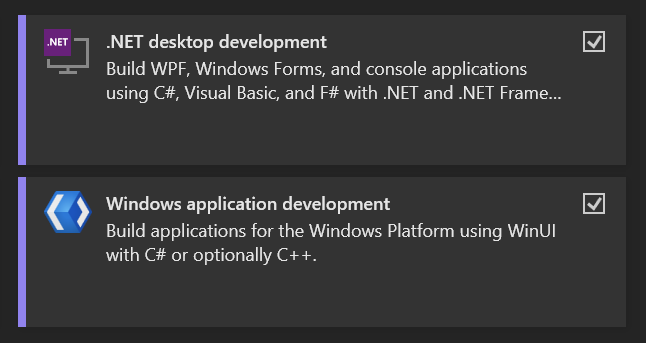

# EpubCSharp

### Description

This is a simple **WINUI** .epub reader that reads epub files and displays them in a webview.
The application is written in C# and XAML and uses JavaScript for scrolling and on-tap translation. It also uses Python for Flask server executing translations using argos-translate package. 

The project was created as a Programming II (NPRG031) MFF CUNI semestral project.

### Features

- reading .epub files
- custom fonts, padding and themes
- adding epub ebooks into “shelf” ( = shelf displayes epubs added into the app )
- in-book translations:
    - selected text translations
    - clicked word translations
    - offline translations using argos-translate
    - online translations using My Memory API
    - displaying saved translations
- displaying reading statistics:
    - all-time reading time
    - reading time per day

---

### Installation

The app currently does not have installer or .exe file. But once you build the app in Visual Studio, you will be able to run the app from Windows Start menu.

- To build the app you’ll need this installed in Visual Studio:



- You will also need these **`C#`** **packages**:
    - https://www.nuget.org/packages/Microsoft.Windows.SDK.BuildTools/10.0.22621.756?_src=template
    - https://www.nuget.org/packages/Microsoft.WindowsAppSDK/1.5.240802000?_src=template
- [optional] for argos translate you will need these **`Python` packages**:
    
    ```bash
    pip install git+https://github.com/sol239/argos-translate-epub-reader.git
    pip install numpy==1.26.4   # numpy >=2 will not work with argos-translate
    pip install Flask   # used for python local server executing argos translations offline
    pip install langdetect # currently not used in the code, but is planned to be added
    ```
    
    ### Run the app
    
    If you installed all of above packages, you can run the app by building it in Visual Studio:
    
    
    
    **Always** use **`Debug`** configuration, other than x64 arch was not tested. If build fails, deploy the solution and then rebuild it. (You can do these in VS `Build` menu.)
    

---

### Documentation

[User Documentation](docs/User%20Documentation.md)

[Technical Documentation](docs/Technical%20Documentation.md)

---

### Project Status

Epub reader is currently finished, features, known issues and bugs are listed here:

[**https://www.notion.so/eBookReader-5e7f5a7d63a2480594e2ca9edecdd5e7**](https://www.notion.so/eBookReader-5e7f5a7d63a2480594e2ca9edecdd5e7?pvs=21)

### Support

If you need help, contact me: david.valek17@gmail.com

You can find this doc at: [https://www.notion.so/EpubReader-8468f6ccb553496d94602b82fc69a495](EpubCSharp%208468f6ccb553496d94602b82fc69a495.md)

---